# PNG Редактор

## Зависимости

* [Qt5](https://www.qt.io/download) Разработка производилась на версии 5.14.2, работоспособность на более низких версиях не гарантируется
* libpng. На Ubuntu/Debian можно установить командой ```sudo apt-get install libpng-dev```

## Сборка

* Открыть проект в QtCreator
* Альтернативный способ.
```
mkdir build && cd build
qmake ../source
make
```

## Примеры работы

### Исходные картинки

1. 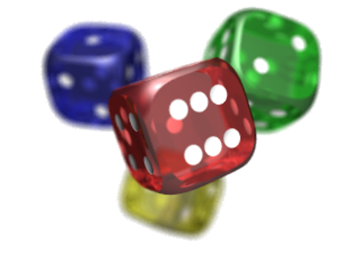
2. 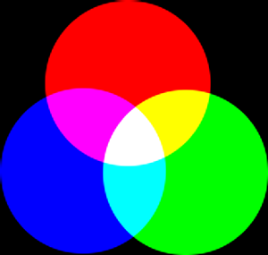
3. 
4. 

### Работа программы

1. Запуск 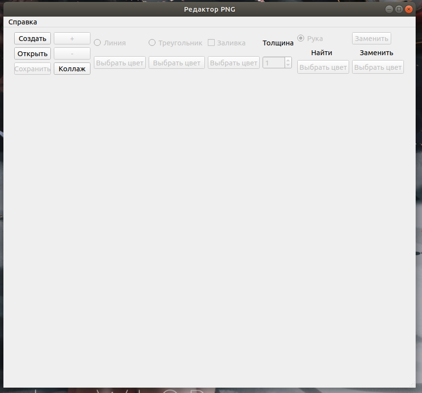
2. Открытие картинки 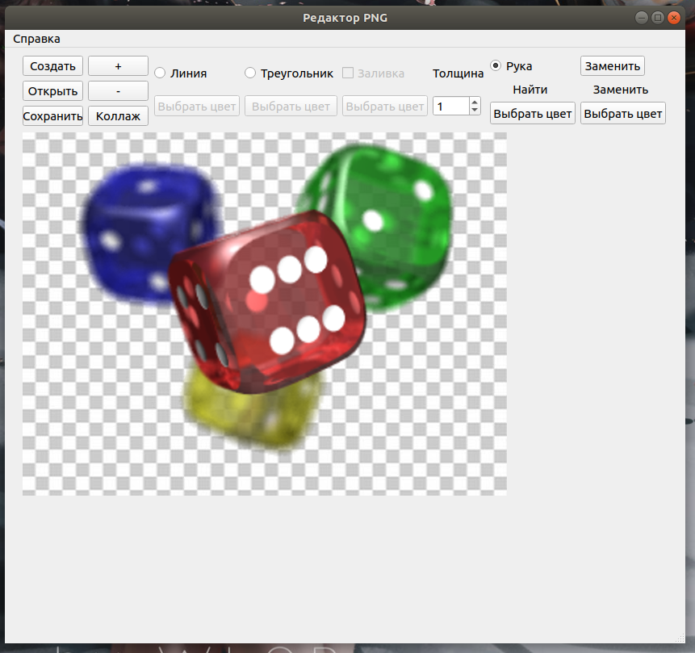
3. Рисвание треугольника 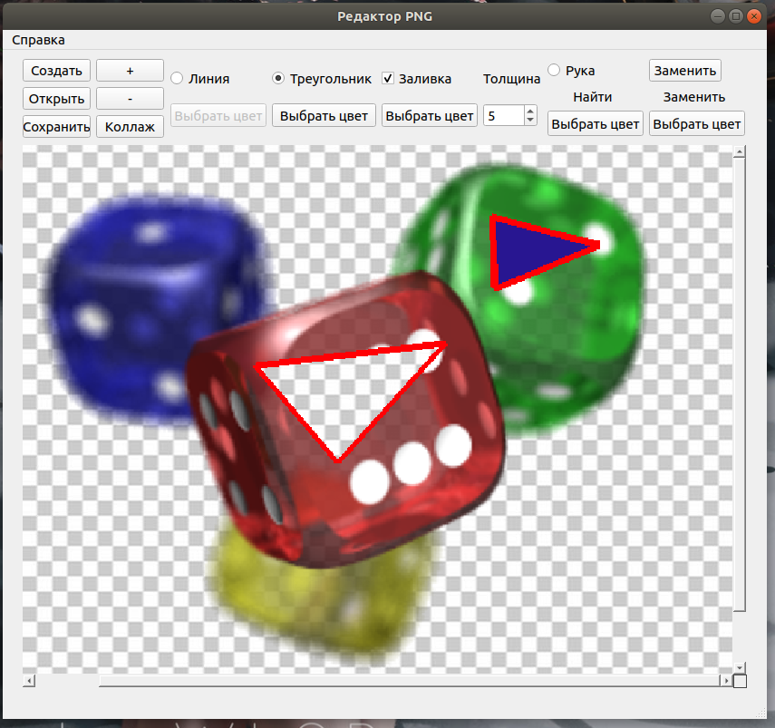
4. Рисование линий 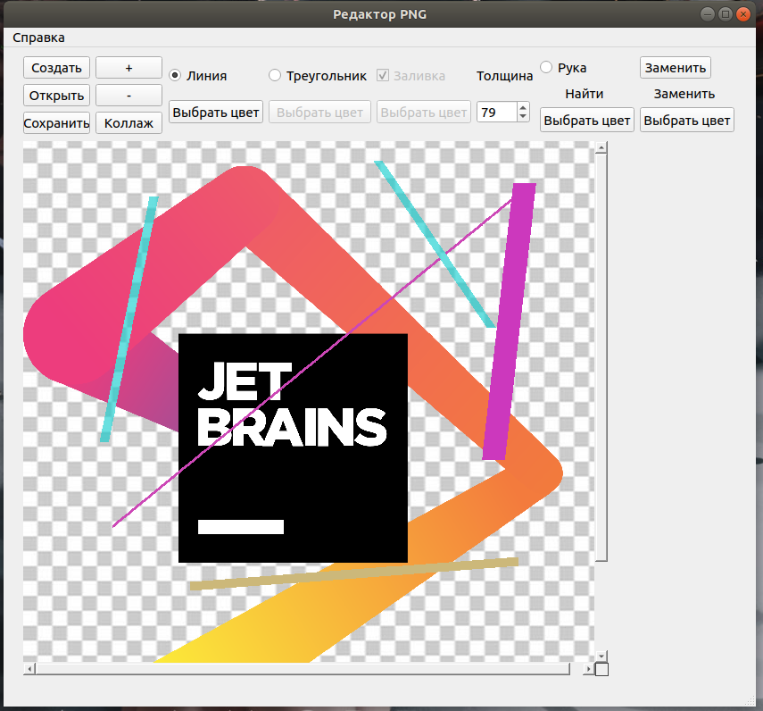
5. Замена наибольшего прямоугольника(4 раза) 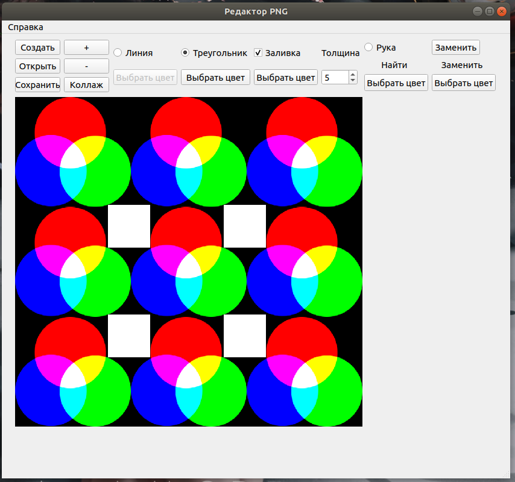
6. Создание колллажа 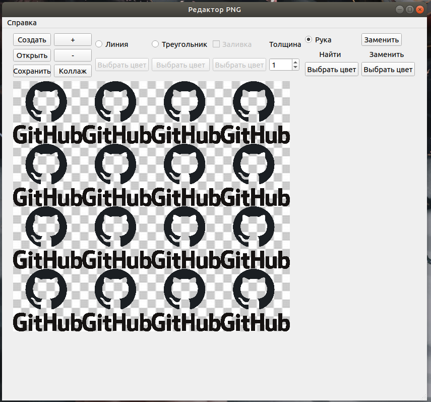
Результаты находятся в папке **Image**, их названия начинаются с _res__

### Обработка ошибок

При ошибке появляется окно, сообщающие об ошибке

1. Открытие файла не являщегося PNG 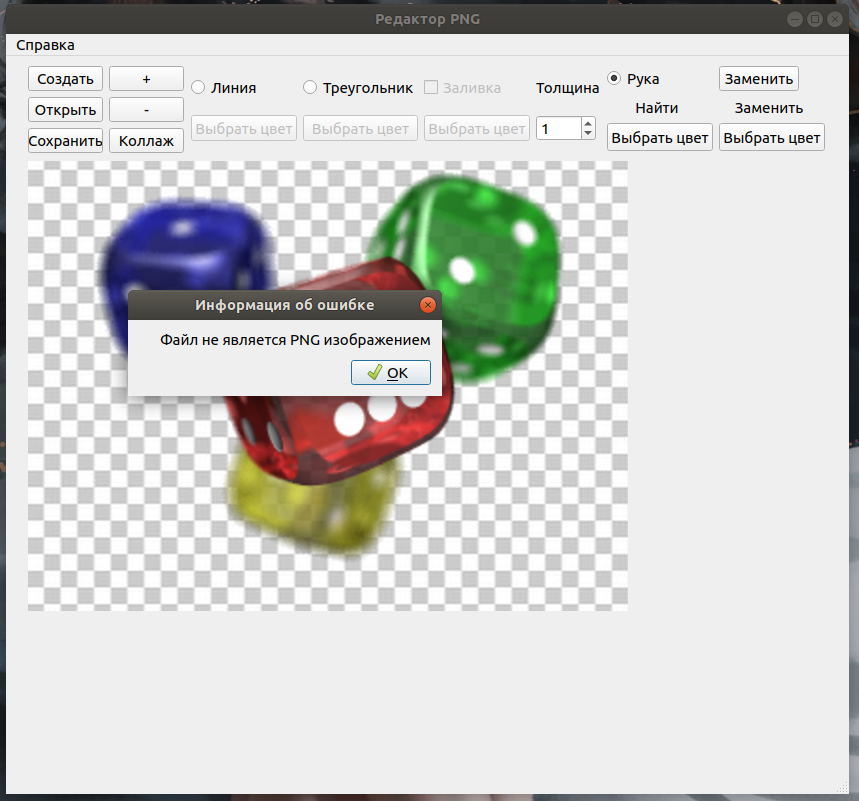
2. Ввод неверных размеров, например, если при создании коллажа, одно из значений ноль 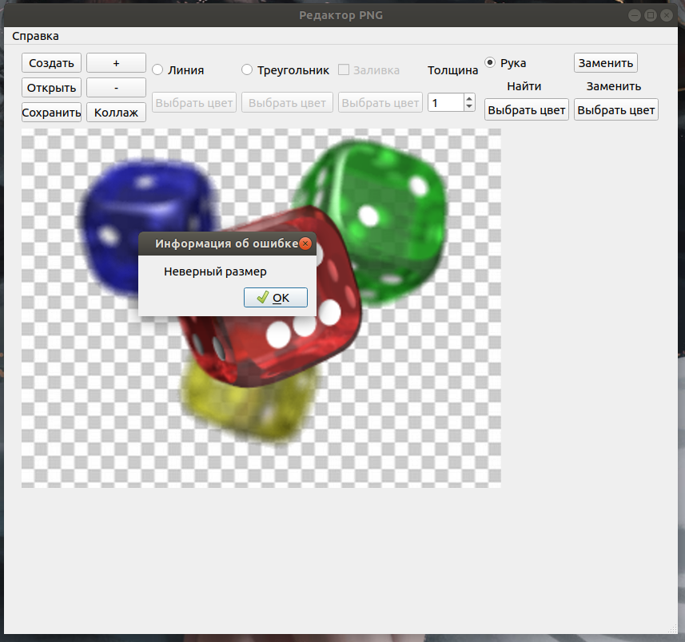
3. PNG изображение имеет не поддерживаемый цветовой тип 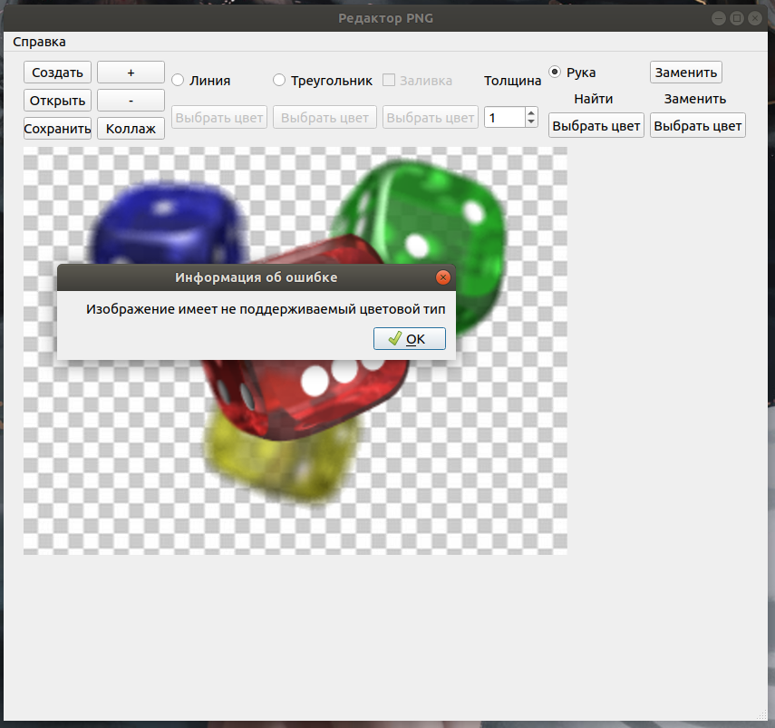
